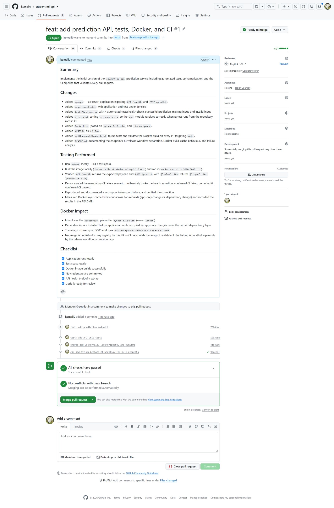
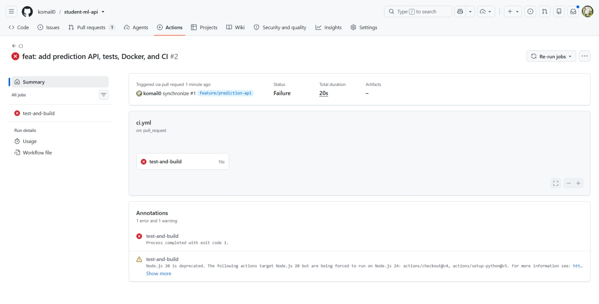
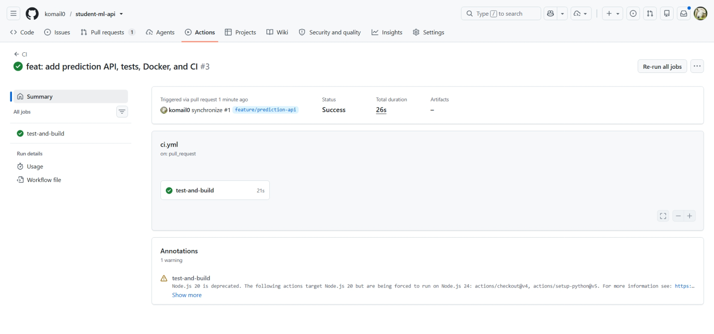

# student-ml-api

A simple ML prediction API demonstrating a professional CI/CD workflow:
feature branches → Pull Requests → GitHub Actions CI → Docker → GitHub Container Registry.

## Endpoints

### `GET /health`

Returns service health and version information.

```json
{
  "status": "healthy",
  "application": "student-ml-api",
  "version": "1.0.0"
}
```

### `POST /predict`

Accepts a numeric input and returns a prediction.

Request:
```json
{ "value": 10 }
```

Response:
```json
{ "input": 10, "prediction": 20 }
```

Missing or non-numeric input returns HTTP 422 (validation error).

## Running Locally

```
pip install -r requirements.txt
pytest
docker build -t student-ml-api:1.0.0 .
docker run -d --name student-ml-api -p 5000:5000 student-ml-api:1.0.0
curl http://localhost:5000/health
```

## CI vs. Release Workflow Separation

The two workflows have deliberately separate responsibilities:

- **`ci.yml`** runs on every pull request into `main`. It installs dependencies, runs `pytest`, and validates that the Docker image *builds* (`docker build`). It never runs `docker push` — it publishes nothing.
- **`release.yml`** runs only when a semantic-version tag (`v*.*.*`) is pushed. It is the sole place images are built and pushed to the registry.

Publishing Docker images directly from every pull request would be undesirable because:
- A PR's code has not been reviewed or merged yet, so unreviewed code would reach the registry and could be deployed by mistake.
- Every PR push would create registry clutter — throwaway tags and image versions with no meaningful relationship to actual releases.
- Fork-originated PRs run untrusted code; a workflow holding registry write credentials at PR time widens the blast radius if that workflow is misconfigured.

Keeping publishing behind a tag push means every published image corresponds to a deliberate, reviewed, merged, and versioned release.

## Docker Build Cache Notes

The Dockerfile copies and installs `requirements.txt` *before* copying `app.py`:

```
COPY requirements.txt .
RUN pip install --no-cache-dir -r requirements.txt
COPY app.py .
```

This ordering means application code changes do not invalidate the dependency-installation layer. Verified directly by rebuilding twice:

**Rebuild after editing only `app.py`** — dependency layers reused:
```
#6 [2/6] WORKDIR /app                                    CACHED
#7 [3/6] COPY requirements.txt .                         CACHED
#8 [4/6] RUN pip install --no-cache-dir -r requirements.txt   CACHED
#9 [5/6] COPY app.py .                                   DONE 0.1s
```
Total rebuild: ~1 second.

**Rebuild after editing `requirements.txt`** — dependency layers invalidated:
```
#6 [2/6] WORKDIR /app                                    CACHED
#7 [3/6] COPY requirements.txt .                         DONE 0.1s
#8 [4/6] RUN pip install --no-cache-dir -r requirements.txt   DONE 35.0s
```
Total rebuild: ~44 seconds — the full dependency install re-ran.

This is why the split ordering is preferable to `COPY . .` followed by `pip install`. With `COPY . .`, *any* source file change (including `app.py`, which never affects dependencies) invalidates the cache from that `COPY` onward, forcing a needless full reinstall on every single build. In CI, where builds run on every push, that difference compounds into significant wasted time.

## Failure Analysis

### 1. Failed pytest

- **Symptom:** The CI workflow failed on this pull request with `AssertionError: assert 'healthy' == 'wrong'`. The `test-and-build` job stopped at the "Run tests" step with exit code 1, and the Docker build step never executed.
- **Root Cause:** `tests/test_app.py::test_health` was deliberately edited to assert `data["status"] == "wrong"` instead of the correct `"healthy"`, as required by the assignment's mandatory failure demonstration. The application itself was correct; the test's expectation was wrong.
- **Evidence:** [Failed CI run 34409447926](https://github.com/komail0/student-ml-api/actions/runs/34409447926), from commit `test: deliberately break health endpoint assertion`. The log shows:
  ```
  E       AssertionError: assert 'healthy' == 'wrong'
  tests/test_app.py:12: AssertionError
  FAILED tests/test_app.py::test_health
  =================== 1 failed, 3 passed, 2 warnings in 0.34s ====================
  ```
- **Correction:** The assertion was reverted to `data["status"] == "healthy"` in the commit `fix: correct health endpoint test`. The subsequent run, [CI run 34409592197](https://github.com/komail0/student-ml-api/actions/runs/34409592197), passed all 4 tests and completed the Docker build validation.

### 2. Wrong container port

- **Symptom:** After starting the container, `curl http://localhost:5000/health` failed with:
  ```
  curl: (7) Failed to connect to localhost port 5000 after 2248 ms: Couldn't connect to server
  ```
  The container was running and healthy — `docker ps` showed it up — but was unreachable at the expected address.
- **Root Cause:** The container was started with `docker run -d --name student-ml-api -p 5001:5000 ...`. The application listens on port 5000 *inside* the container (per `EXPOSE 5000` and `uvicorn --port 5000`), but the `-p` flag published it to host port **5001**, not 5000. Nothing was listening on host port 5000, so the connection was refused. This is a host-to-container port mapping error, not an application fault.
- **Evidence:** With the same container running, `curl http://localhost:5001/health` returned the correct payload:
  ```
  {"status":"healthy","application":"student-ml-api","version":"1.0.0"}
  ```
  confirming the app was working and only the published port differed.
- **Correction:** Restarted the container with a matching mapping, `docker run -d --name student-ml-api -p 5000:5000 student-ml-api:1.0.0`. `curl http://localhost:5000/health` then returned the expected response.

## Evidence

**Pull request opened** — with the required description sections:



**CI failed** — the mandatory deliberate-failure demonstration:



**CI passed** — after correcting the test:


